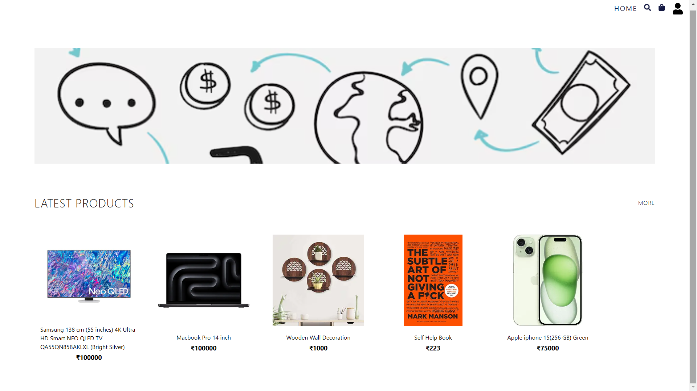

# MarketPlace



**MarketPlace** is a fully functional e-commerce web application built to provide users with an easy, efficient, and seamless shopping experience. While building this project, I focused on learning and implementing new technologies like TypeScript, Redux Toolkit, Firebase, and MongoDB to create an optimal blend of frontend performance and backend scalability. 

This platform includes features commonly found in professional e-commerce websites, such as user authentication, product search and sorting, a cart system with coupons, and order management. Additionally, an admin panel enables product and order management, providing essential data analytics and visual insights into sales and transactions.

---

## About

MarketPlace aims to deliver a modern shopping experience for customers while also offering extensive management tools for administrators. It is designed with scalability in mind, using efficient data handling techniques and caching strategies to maintain high performance under load.

The application serves two types of users:

1. **Customer**: Customers can explore products, add them to their cart, apply discounts using coupon codes, and complete their purchases through a secure payment process. Additionally, they can track the status of their orders through the "Orders" section.

2. **Admin**: Admins have access to a powerful dashboard that allows them to manage the product catalog, handle orders and transactions, and visualize important business data through various types of charts, such as line, pie, and bar graphs.

The goal was to create a fully operational e-commerce platform where both the customer-facing and admin-facing features align with real-world business needs.

---

## How It Works

1. **User Authentication & Authorization**:
   - The user authentication system is powered by **Firebase**, ensuring secure and smooth sign-up and login processes. Both customers and admins have distinct roles and access permissions, with admin privileges restricted to specific users.
   
2. **Product Display & Search**:
   - After logging in, users are greeted with the latest products on the homepage. Users can search for products based on specific categories, such as electronics, fashion, etc., and sort products by price, which enhances the user’s shopping experience.

3. **Cart System**:
   - The cart system allows users to add multiple items and view their order summary, including item price, taxes, and total cost. A **coupon system** is integrated to allow users to apply discount codes for savings, with the cart recalculating the total cost accordingly.

4. **Order & Payment Processing**:
   - Once users proceed to payment, they can make secure payments and view their order status in the "Orders" section. The order status includes details about the product shipment, estimated delivery time, and past orders.

5. **Admin Dashboard**:
   - The admin panel provides advanced functionality where the admin can:
     - Add, update, and delete products.
     - View and manage orders placed by customers.
     - Access transactional data, including revenue generated, order counts, and customer details.
     - **Data visualization** through **React Charts**: Admins can see their sales data represented via line graphs (for sales trends), pie charts (for product category distribution), and bar graphs (for monthly revenue analysis).

---

## Features

### Customer-Side Features:
1. **User Registration/Login**: 
   - A secure registration and login system managed by Firebase, ensuring that customer data is safely stored and easily retrieved.
   
2. **Product Browsing & Filtering**:
   - Users can browse products by categories and sort them by price. The system supports filtering products by relevance, allowing customers to quickly find what they're looking for.

3. **Shopping Cart**:
   - A user-friendly cart system where customers can add products, adjust quantities, apply discount coupons, and see the total cost including taxes.

4. **Order Management**:
   - Once an order is placed, users can track the order's progress from "Pending" to "Shipped" to "Delivered" in the Orders section. This feature also allows customers to view their order history.

### Admin-Side Features:
1. **Product Management**:
   - Admins can add, edit, and delete products from the catalog. They can update product prices, descriptions, and images as needed.

2. **Order and Transaction Management**:
   - Admins have access to a list of all orders placed by customers, including transaction details, shipping status, and customer information. This data helps admins fulfill orders efficiently.

3. **Data Analytics Dashboard**:
   - The dashboard provides insights into sales trends and product performance through graphical visualizations:
     - **Line Graph**: Tracks sales trends over time.
     - **Pie Chart**: Displays the distribution of products sold by category.
     - **Bar Graph**: Highlights monthly revenue.

---

## Feature Snapshots

Here are some snapshots demonstrating the core features of MarketPlace:

### Customer Interface

- .png)
  _The homepage displaying the latest products and categories._

- .png)
  _Search and sort products based on categories and price._

- .png)
  _The cart page showing product details, coupon application, taxes, and total._

### Admin Interface

- .png)
  _The admin dashboard with product management options and data visualizations._

- .png)
  _Order management interface where admins can view and process customer orders._

- .png)
  _Line, pie, and bar graphs displaying sales and revenue insights._

---

## Technologies Used

### Frontend:
- **TypeScript**: Strongly typed programming language for maintaining a robust and error-free codebase.
- **SCSS**: Used for styling the frontend, enabling dynamic and reusable stylesheets.
- **React**: Component-based library for building the user interface.
- **Redux/Redux Toolkit Query**: For efficient state management and asynchronous data fetching between the frontend and backend.
- **Axios**: For making HTTP requests to the backend API and managing data.

### Backend:
- **TypeScript**: Used for ensuring type safety and better code readability on the server-side.
- **Node.js**: JavaScript runtime for building the backend API.
- **Express**: Web framework for building server-side functionality.
- **MongoDB**: NoSQL database for storing user data, product details, and order information.
- **Node-Cache**: Caching layer to optimize data retrieval speed.

### Other Technologies:
- **Firebase**: User authentication and authorization system.
- **React Table**: For managing product and order listings in the admin panel.
- **React Charts**: For creating data visualizations in the admin dashboard.

---

## Difficult Part

One of the major challenges was working with **TypeScript** for the first time. As someone new to TypeScript, setting up the development environment and managing type definitions was a significant learning curve. The separation of concerns with types, interfaces, and functional components required extra attention to detail to avoid errors.

Another challenge was integrating **React Charts** and using **Redux Toolkit Query** to fetch and manage data asynchronously. I encountered various issues with setting up these libraries, but with persistent research, references, and help from ChatGPT, I was able to successfully implement them.

---

## Future Scope

- **Redis Integration**: I plan to scale the backend further by integrating **Redis** to improve the speed and efficiency of data retrieval, especially for high-traffic scenarios.
- **Advanced Filtering & Sorting**: In the future, I aim to add more advanced filters and sorting mechanisms, including by brand, rating, and customer reviews, to enhance the shopping experience.
- **Analytics Expansion**: I also intend to expand the admin dashboard with more granular data insights and analytics to help admins make better decisions regarding product promotions and stock management.

---

## How to Install

To run this project locally, follow these steps:

1. Clone the repository:
   ```bash
   git clone https://github.com/your-username/MarketPlace.git
